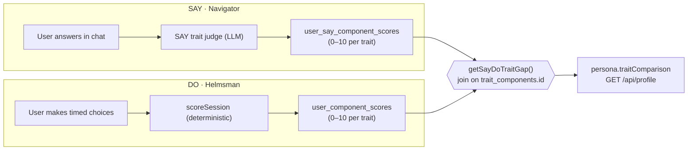

# The Say–Do Gap — concept, data model, and implementation status

> **Purpose of this document.** Purple Spark measures the gap between what a leader
> *says* they value and what they actually *do* under pressure. The **Do** side has
> shipped for a while; the **Say** side was recently built out so both are scored on
> the *same* trait catalogue and can be compared trait-by-trait. This document
> explains the concept, the Supabase tables involved, and everything that was
> implemented, so another project/team can understand what is complete.
>
> **Status:** ✅ Code complete, production build passes (strict TypeScript).
> ⚠️ The database migration must be applied **by hand** (Supabase never runs
> migrations automatically). One dry-run has been verified against the live trait
> catalogue and produces sensible per-trait scores.

---

## 1. What the Say–Do Gap is

Purple Spark captures two complementary signals for every user and joins them on a
single key (`userId`, which is the user's email):

| Layer | Product surface | Signal | "Ground truth" of… |
|-------|-----------------|--------|--------------------|
| **Say** | **Navigator** — a private, RAG-grounded reflective chat | what the user *says* about how they lead | stated values / intentions |
| **Do**  | **Helmsman** — timed decision simulations | what the user *does* under pressure | revealed behaviour |

Both layers are scored against the **same catalogue of leadership trait components**
on the **same 0–10 scale**. The **Say–Do Gap** for a trait is simply:

```
gap(trait) = | say_score(trait) − do_score(trait) |
```

A large gap on, say, *Integrity* means the user talks about honesty far more (or
far less) than their simulated choices demonstrate it. That divergence — not
either score alone — is the product's core insight.



### Why the two sides are actually comparable

Comparability is guaranteed by construction, not by convention:

1. **Same catalogue.** Both sides reference rows in the `trait_components` table by
   its primary key (`id`, a UUID). Neither side keeps its own private trait list, so
   they cannot drift.
2. **Same scale & normalization.** Each side collects signed, per-event *impacts* in
   roughly `[-1, +1]`, sums them, and runs the sum through the **same sigmoid** to
   land in `0–10` (`5.0` = neutral):

   ```
   score = 10 / (1 + e^(−sum / 2.5))
   ```

   (Implemented once in `lib/scoring/componentScorer.ts` → `normalizeToScores`, and
   reused by the Say side.)

Because of this, a `0–10` Say score means the same thing as a `0–10` Do score, and
the gap is a straight subtraction.

> **Important nuance — "54" vs the real count.** People often say "the 54 traits."
> `54` is only the **dimensionality of the Do-layer profile *vector*** (the
> `profile_vectors` pgvector column; `assemble_profile_vector` pads/trims to exactly
> 54). The **active `trait_components` catalogue is larger — ~81 rows** in the
> current database. The Say scorer and the gap comparison operate on the **full
> active catalogue**, keyed by `trait_components.id`, exactly as `user_component_scores`
> already does. So the comparison is valid across all active traits; just don't
> expect the count to be literally 54.

---

## 2. Supabase tables involved

All tables below live in the **main application** Supabase project (Purple Spark
also has a *separate* "Helmsman content" project for scenario graphs — not relevant
here). Every table keys to the user by `user_id`, which is the user's **email**
(`users.email` is the primary key). Row-Level Security is enabled on every table
with **no policy**; the server uses the service-role key, which bypasses RLS, while
the anon key is blocked by default.

### The shared trait catalogue (pre-existing)

**`trait_components`** — the single source of truth for the traits. Defined in
`supabase/profile-pipeline.sql`. *Not seeded by the repo — the rows are provisioned
directly in Supabase.*

| Column | Type | Notes |
|--------|------|-------|
| `id` | uuid (PK) | FK target for all score tables |
| `component_id` | text (unique) | Human code, e.g. `"A086"`. Used in LLM prompts & scenario JSON |
| `name` | text | e.g. `"Integrity"` |
| `tier` | text | `A` \| `B` \| `C` |
| `is_active` | boolean | Only active rows are scored |
| `dimension_index` | integer | Position in the 54-dim Do vector (subset of active rows) |
| `what_it_is` | text (nullable) | Plain-language definition; fed to the Say judge's prompt |

### The DO side (pre-existing)

**`user_component_scores`** — running Do-layer score per trait.

| Column | Type | Notes |
|--------|------|-------|
| `user_id` | text → `users.email` | |
| `component_id` | uuid → `trait_components.id` | |
| `score` | numeric, `0..10` | |
| `last_session_id` | text | |
| `updated_at` | timestamptz | |
| **PK** | `(user_id, component_id)` | |

Fed by `scoreSession` (`lib/scoring/componentScorer.ts`) at the end of a Helmsman
simulation, from each decision's `scoreImpact`. Also aggregated into
`profile_vectors` (the 54-dim pgvector) and `user_z_scores` — neither is required
for the Say–Do gap.

### The SAY side (NEW — added by this work)

**`navigator_turn_component_scores`** — per-turn **raw evidence** from the Say judge.
One row per (message, trait). This is the audit trail and makes the running score
fully rebuildable.

| Column | Type | Notes |
|--------|------|-------|
| `id` | text (PK) | app-generated |
| `message_id` | text → `navigator_messages.id` | the user answer that was scored |
| `user_id` | text → `users.email` | |
| `component_id` | uuid → `trait_components.id` | |
| `raw_impact` | numeric | signed evidence for this turn, ~`[-1, +1]` |
| `rationale` | text (nullable) | one-sentence justification from the model |
| `created_at` | timestamptz | |
| **unique** | `(message_id, component_id)` | re-judging a turn upserts, never dupes |

**`user_say_component_scores`** — running **Say-layer score per trait** (the direct
mirror of `user_component_scores`). **This is the table you compare against the Do
side.**

| Column | Type | Notes |
|--------|------|-------|
| `user_id` | text → `users.email` | |
| `component_id` | uuid → `trait_components.id` | |
| `score` | numeric, `0..10` | sigmoid of the summed raw impacts |
| `evidence_count` | integer | how many turns contributed |
| `last_message_id` | text → `navigator_messages.id` | |
| `updated_at` | timestamptz | |
| **PK** | `(user_id, component_id)` | |

### Supporting Navigator tables (pre-existing, for context)

- **`navigator_messages`** — every chat turn (`role`, `content`, `source`,
  `retrieved_chunks`, …). The Say judge scores a **user** message; its `id` is the
  `message_id` in the two tables above.
- **`navigator_conversations`**, **`navigator_profiles`** (a separate keyword-signal
  fingerprint), **`navigator_discoveries`**.
- **`navigator_turn_scores`** — the **old** 2-axis reply-quality judge output.
  **Superseded and now dormant** — the live pipeline no longer writes to it (see
  §5). Left in place so historical data and its maintenance scripts keep working.

---

## 3. How the SAY scoring works, end to end

Triggered **per Navigator message**, fire-and-forget (never blocks the reply):

1. A user sends a message in Navigator. The pipeline stores it, generates the
   RAG-grounded reply, and stores that.
2. **After** the reply is sent, the pipeline calls the Say judge with the user's
   answer, Navigator's *previous* question, and any retrieved source chunks.
   *(The very first message answers no question, so it is skipped.)*
3. The **Say judge** (`lib/navigator/sayTraitJudge.ts`) makes one LLM call:
   - It loads the active `trait_components` catalogue and puts it in the prompt
     (`code — name: definition`).
   - The model returns a **sparse, signed** list: only the traits the answer gives
     real evidence for, each as `{ component_id, impact ∈ [-1,1], rationale }`
     (capped at 8 per turn, constrained to valid codes).
4. The **accumulator** (`lib/scoring/sayComponentScorer.ts`):
   - writes the raw impacts to `navigator_turn_component_scores`, then
   - recomputes each affected trait's running score as
     `sigmoid(sum of ALL that user's raw impacts for the trait)` and upserts it into
     `user_say_component_scores` (with `evidence_count`).

**Accumulation model:** *recompute-from-raw, no decay.* A single turn nudges a
score only slightly (sigmoid of a small sum); consistent evidence across several
turns is what moves a trait meaningfully away from `5.0`. Because the aggregate is
derived from the raw rows, it can always be rebuilt from scratch.

**LLM details:** Google Gemini via `services/vertexClient.ts`
(`generateStructuredResponse`, JSON mode, low temperature for repeatability). Model
is configurable via `VERTEX_GEMINI_MODEL`. **Fail-soft everywhere** — a missing API
key, an empty catalogue, or a malformed response is logged and dropped; it never
throws into the message path, and it never blocks or slows the user's reply.

---

## 4. How to read the comparison

`getSayDoTraitGap(userId)` (`lib/scoring/sayComponentScorer.ts`) joins
`trait_components` × `user_component_scores` (Do) × `user_say_component_scores`
(Say) and returns, per active trait:

```ts
interface TraitGapEntry {
  componentId: string;      // e.g. "A086"
  name: string;             // e.g. "Integrity"
  tier: "A" | "B" | "C";
  doScore: number | null;   // null if no Do evidence yet
  sayScore: number | null;  // null if no Say evidence yet
  gap: number;              // |do − say|, neutral-filled (5.0) for a missing side
}
```

Sorted by `gap` descending. Surfaced through the unified read model:

- **`lib/persona.ts`** → `Persona.traitComparison: TraitGapEntry[]`
  (plus `meta.hasTraitComparison`, true once both sides have data on ≥1 trait).
- **`GET /api/profile?userId=<email>&refresh=1`** returns the full persona, so the
  Dashboard/Profile receive `persona.traitComparison` with no route change.

> Unscored sides are neutral-filled to `5.0` (the same convention
> `assemble_profile_vector` uses) so the gap is always defined. A user needs both a
> Navigator conversation **and** a Helmsman simulation for the gap to be meaningful;
> otherwise one side reads neutral.

---

## 5. Everything that was built (change map)

**New files**

| File | Role |
|------|------|
| `supabase/2026-07-say-component-scores-migration.sql` | Idempotent migration — creates the two new tables + indexes + RLS |
| `lib/navigator/sayTraitJudge.ts` | The Say-side LLM judge: `scoreSayTurn` (scores, no write), `judgeSayTraits` (scores + persists), `shouldScoreSayTraits` (gate) |
| `lib/scoring/sayComponentScorer.ts` | `recordSayTurnImpacts` (persist raw + recompute running score) and `getSayDoTraitGap` (the comparison join); `SayTurnImpact` / `TraitGapEntry` types |
| `scripts/probe-say-traits.ts` | Dry-run probe: runs the real judge over one answer and prints the trait impacts. **Writes nothing.** |

**Edited files**

| File | Change |
|------|--------|
| `supabase/profile-pipeline.sql` | Mirrored the two new tables next to `user_component_scores` (their FK target `trait_components` lives here), plus their RLS enables — so fresh installs pick them up |
| `lib/db/traitComponents.ts` | `listActiveTraitComponents()` now also selects `what_it_is` (additive; existing callers unaffected) |
| `lib/navigator/pipeline.ts` | Per-turn scoring call swapped from the old `judgeTurn` (2-axis) to `judgeSayTraits` (54/81-trait). Still exactly one deferred LLM scoring call per turn |
| `lib/persona.ts` | Added `traitComparison` + `meta.hasTraitComparison` to the `Persona` read model, populated via `getSayDoTraitGap` |

**Deliberately NOT changed (out of scope)**

- The Do-layer pgvector functions and their app-side mirror (`profileVectorBuild.ts`)
  — no parallel 54-dim "Say vector" was built. The comparison is per-trait scores, by
  design (simpler, and avoids the risk of the SQL and its TS mirror diverging).
- The old `navigator_turn_scores` table, `lib/navigator/judge.ts`, and the
  `calibrate/backfill/report-navigator-scores` scripts — left dormant but intact.

---

## 6. How to run / verify it

**Prerequisites:** a Gemini key (`VERTEX_API_KEY` or `GOOGLE_API_KEY`) in `.env`,
and `trait_components` seeded in Supabase.

1. **Apply the migration by hand** (the app never runs migrations):
   Supabase SQL editor, or `supabase db execute -f supabase/2026-07-say-component-scores-migration.sql`.
   Sanity check: `select count(*) from user_say_component_scores;` should return `0`,
   not an error.
2. **Dry-run the judge (no DB writes, no conversation needed):**
   ```
   npx tsx --env-file=.env scripts/probe-say-traits.ts
   npx tsx --env-file=.env scripts/probe-say-traits.ts --question "..." --answer "..."
   ```
   Prints the per-trait impacts + rationales for a sample (or supplied) answer.
3. **Live end-to-end:** `npm run dev` → open `/navigator` → send **at least two**
   messages (the opener isn't scored). A few seconds after each reply, the two new
   tables populate for your `user_id` (email). Watch:
   - `navigator_turn_component_scores` (raw impacts + rationales for that message), then
   - `user_say_component_scores` (your running 0–10 per trait).
4. **See the comparison:** `GET /api/profile?userId=<email>&refresh=1` →
   `persona.traitComparison`.
5. **Type checking:** `npm run build` (strict TS is the typecheck; there is no
   standalone `typecheck` script).

> **Known environment issue:** `npm run lint` currently crashes on config load
> (`TypeError: Converting circular structure to JSON` in `.eslintrc.json`). This is
> **pre-existing and unrelated** to this work — it fails before reading any source
> file. Use `npm run build` as the authoritative check.

---

## 7. Sample output (verified dry-run)

Running the probe against the live catalogue with a sample reflection about telling
a team hard news early produced (abridged):

```
7 trait(s) evidenced (strongest first):
  A086 Integrity: +1.00
     ↳ "I'd rather be honest early... than protect my image and lose their trust."
  B059 Honesty: +1.00
  B041 Trust Building: +0.90
  C033 Integrity - Self-Report Signals: +0.90
  B056 Ethical Decision Foundation: +0.80
  B060 Authenticity: +0.80
  A131 Self-awareness: +0.70
```

This confirms the Say judge reads a leader's answer and emits grounded, signed,
per-trait evidence against the shared catalogue — the raw material of the Say–Do gap.

---

## 8. Open items / possible next steps

- **A terminal gap report** (`scripts/report-say-do-gap.ts`) that prints
  `getSayDoTraitGap(userId)` as a ranked table — the persisted counterpart to the
  dry-run probe. *(Not yet built.)*
- **A Say-side backfill** over historical Navigator conversations (mirroring the
  existing `backfill-navigator-scores.ts`), to score past chats.
- **UI**: `persona.traitComparison` is returned by the API but not yet rendered on
  the Dashboard/Profile.
- **Cadence/cost control**: the judge runs on every scored turn. `shouldScoreSayTraits()`
  is the seam to add sampling or a per-N-turns cadence if LLM cost becomes a concern.
- **Retiring the old 2-axis judge** (`navigator_turn_scores`) entirely, once nothing
  needs its historical data.
